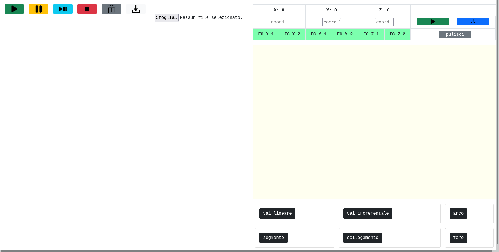

# Stampante PCB 

In questo progetto abbiamo costruito una stampante PCB.

**Tutte le misurazioni che si utilizzano sono in centesimo di millimetro.**

### Funzionamento

La stampante PCB è gestita nel seguente modo:
- un web server esegue i programmi che sono stati inviati da un client, con eventuali priorità, decodificando le istruzioni in movimenti per gli stepmotor
degli assi X, Y e Z. 
Di seguito sono riportate alcune immagini della stampante:

---

### Interfaccia
La stampante PCB presenta un'interfaccia web.

Come si può vedere dall'immagine riportata sopra, a destra sono presenti tutte le funzioni implementate che si possono aggiungere 
nella parte sinistra con un semplice *click*. Inoltre nella parte in alto a sinistra è presente una sezione che mostra in tempo reale le coordinate 
della punta e lo stato dei finecorsa e che permette 
in qualnque momento (anche durante l'esecuzione di un codice) di spostare la punta secondo le coordinate che sono state date o di 
"*settare*" uno zero diverso da quello assoluto, in base alle esigenze.
Inoltre in basso è presente un _canvas_ che disegna l'istruzione che sta eseguendo in tempo reale. Può essere disegnata con tre colori diversi:

| Colore | Significato |
| :-------- | :------- |
| `blu` | Significa che l'asse Z è negativo |
| `verde` | Significa che l'asse Z è positivo |
| `rosso` | Significa che l'asse Z è 0 |

Sono anche presenti i seguenti pulsanti:
| Immagine | Significato del pulsante |Descrizione della funzione |
| :-------- | :------- | :------------------------- |
| | `Esegui codice` | Serve per far eseguire il codice presente a sinistra |
| | `Pausa` | Serve per fermare temporaneamente il codice, facendo rimanere il programma bloccato al punto in cui è stato interrotto |
| | `Riprendi esecuzione` | Serve per far riprende l'esecuzione del porgramma dopo aver premuto su `Pausa` |
| | `Termina esecuzione` | Serve per terminare in modo definitivo il programma in esecuzione |
| | `Elimina tutti i comandi` | Serve per eliminare tutti i comandi |
| | `Scarica codice` | Serve per scaricare il codice che è stato scritto in formato `txt` |
| | `Sfoglia` | Serve caricare un codice (valido) in formato `txt` |

Nel momento in cui si avvia l'esecuzione del programma verrà mostrato in tempo reale quale istruzione sta eseguendo e 
lo stato di ogni istruzione già eseguita.

---

#### Funzioni
Le funzioni base che si possono utilizzare sono:
| Nome | Parametri | Descrizione |
| :-------- | :------- | :------------------------- |
| `vai_lineare` | coordx, coordy, coordz | Sposta la punta alle coordinate assolute indicate come parametro |
| `vai_incrementale` | coordx, coordy, coordz | Sposta la punta di quanto indicato come parametro |
| `foro` | profondità | La punta crea un foro, muovendo l'asse Z di quanto indicato |
| `segmento` | lunghezza, inclinazione | Crea un segmento di lunghezza ed inclinazione indicata |
| `collegamento` | lunghezza, larghezza, inclinazione | Crea due segmenti paralleli, di lungehzza ed inclinazione indicata, che distano di *larghezza* |
| `arco` | raggio, angolo_iniziale, angolo_finale | Partendo dal centro crea un arco con i parametri indicati|

---

### Autori
- [@GabrieleFerrero](https://github.com/GabrieleFerrero)
- [@IsabellaBianco](https://github.com/IsabellaBianco)

