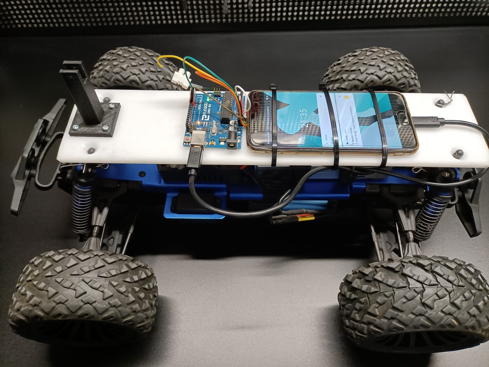
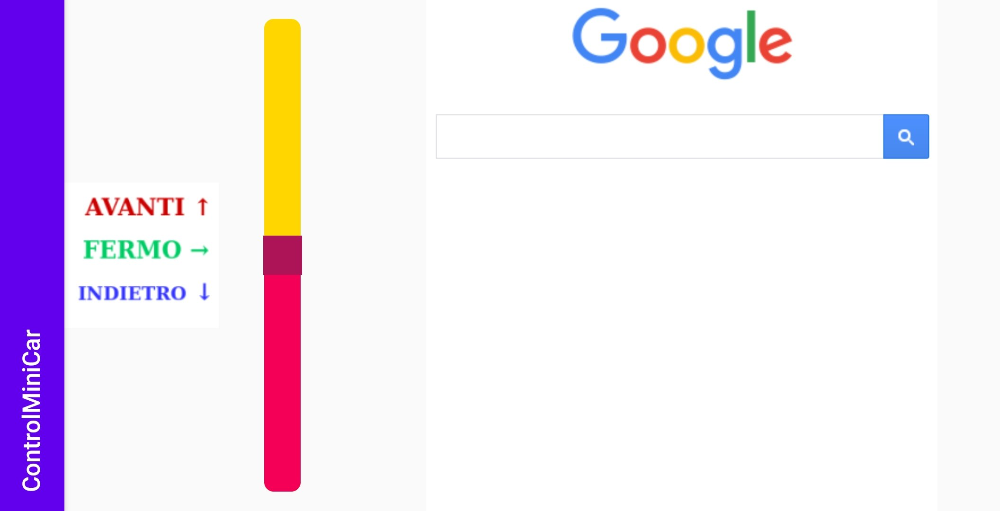

# Controllo Automobilina

In questo progetto abbiamo creato un programma per telecomandare un'automobilina, con un telefono Android.

### Funzionamento

Attraverso l'applicazione Android si va a rilevare l'inclinazione del telefono (angolo sterzo) e la posizione della seekbar (acceleratore). Queste informazioni vengono trasmesse attraverso delle richieste post ad un web server di **ngrok**, il quale inoltrerà queste richieste al telefono a cui esso sta facendo tunneling.
Una volta ricevuti i dati, il telefono inoltrerà le informazioni ad un server UDP (localhost) a cui è direttamente collegato arduino che provvederà ad eseguire i comandi.

Il programma che mette in comunicazione il server interno e ngrok è il `main.py`.

Di seguito è riportata un'immagine dell'automobilina:

---

### Interfaccia
L'automobilina si comanda attraverso un'applicazione android

Come si può vedere dall'immagine riportata sopra, a sinistra è presente una `seekbar` dove è possibile regolare il verso e la velocità dell'automobilina, mentre a destra (dove nella foto è presente la pagina di google) sarà presente il video in diretta registrato dal telefono sopra all'automobilina.
Inoltre per poter sterzare è sufficiente inclinare il telefono.

---

### Autori
- [@GabrieleFerrero](https://github.com/GabrieleFerrero)
- [@IsabellaBianco](https://github.com/IsabellaBianco)

