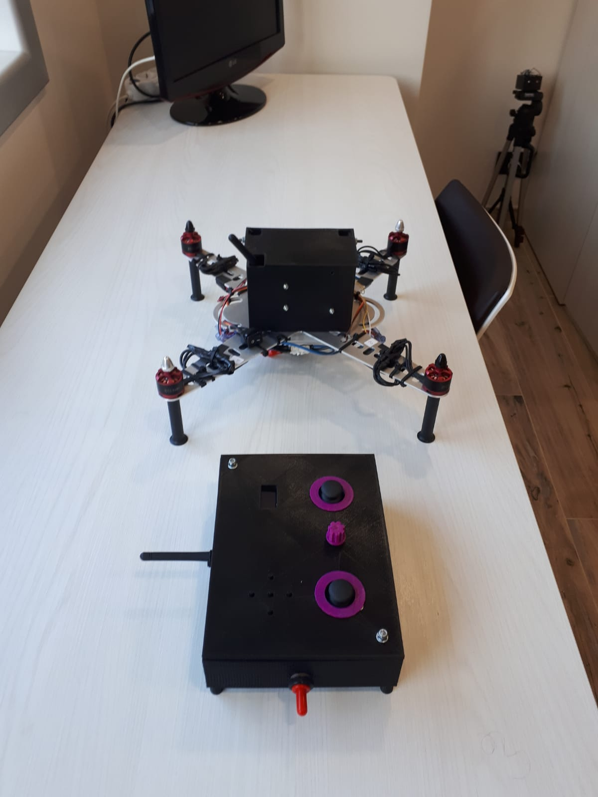
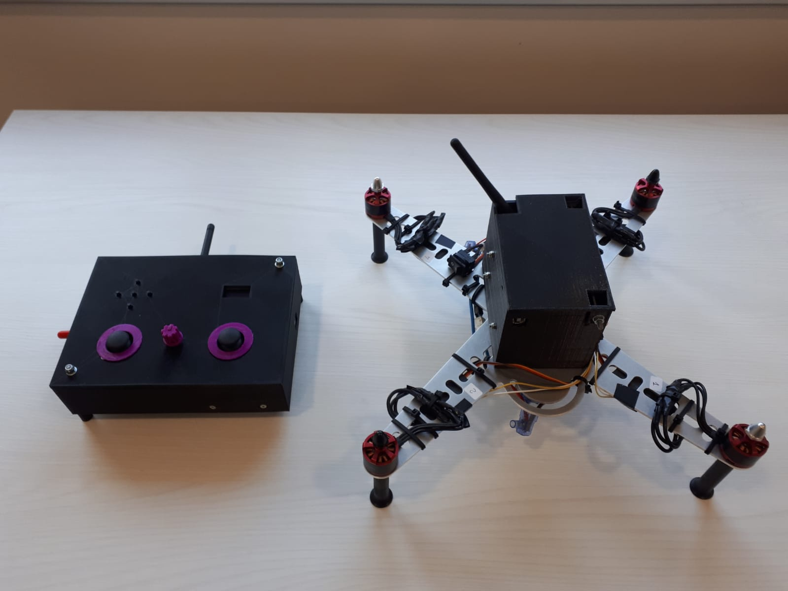
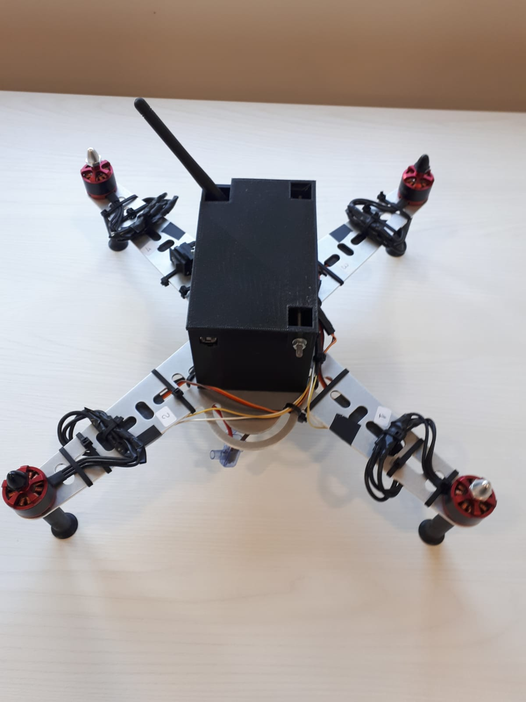
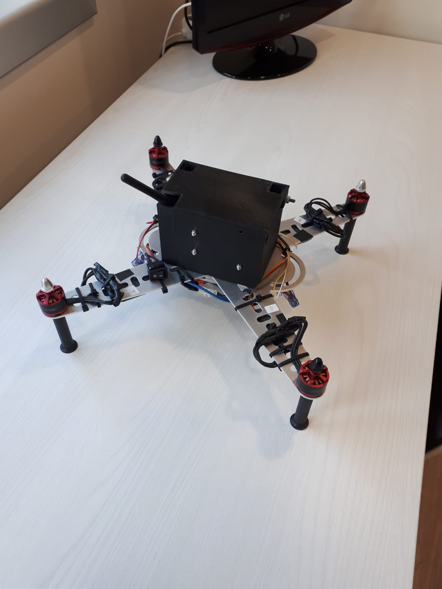

# Drone
In questo progetto è stato realizzato un drone.
All'interno è presente un Arduino Uno che si occupa del controllo dei motori delle eliche, della lettura del giroscopio e della comunicazione con il suo relativo telecomando. 

Di seguito sono riportate alcune immagini del progetto.

</img>
</img>
</img>
</img>
