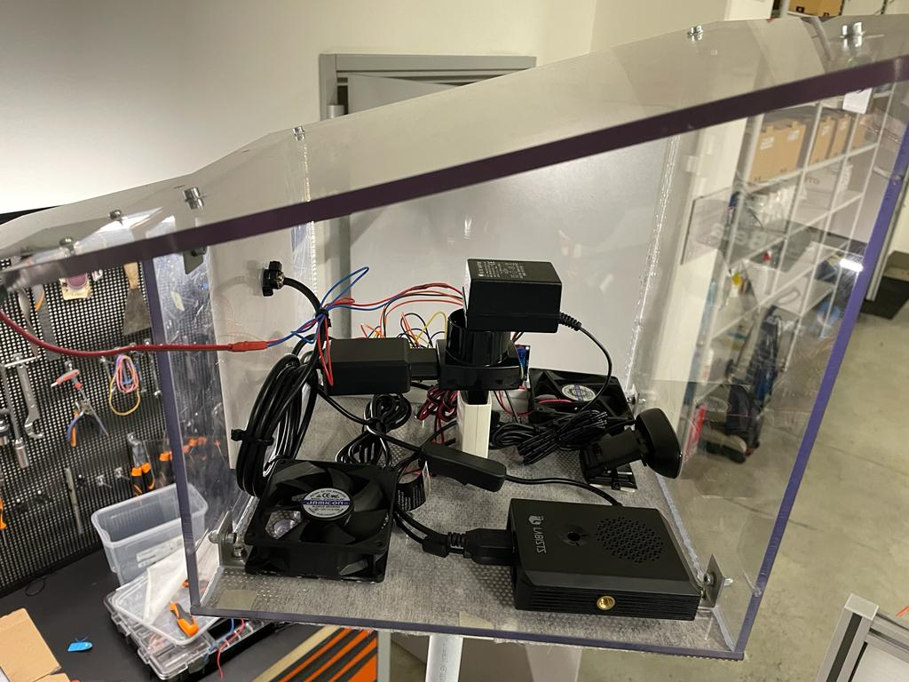
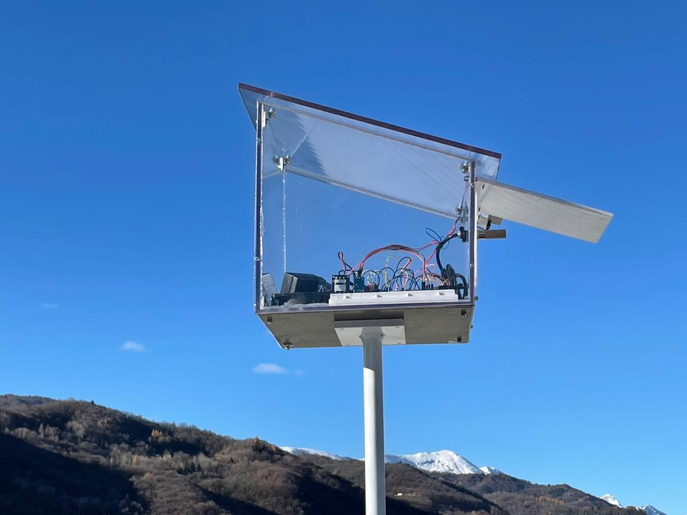

# Stazione meteorologica

In questo progetto abbiamo costruito una stazione meteorologica.

#### Componenti
All'interno della nostra stazione meteorologica sono presenti i 
seguenti sensori e i seguenti componenti (per maggiori specifiche
è possibile consultare il link del fornitore, inserito nella tabella):

| Componente | Modello     | Link del produttore                |
| :-------- | :------- | :------------------------- |
| Sensore di pioggia | *Regen sensor* |[FuturaShop](https://www.futurashop.it/sensore-pioggia-con-elettronica-2846-rainmod?search=%20%092846-RAINMOD) |
| Sensore di luce ambientale |derivazione del MAX44009 |[FuturaShop](https://www.futurashop.it/sensore-di-luce-ambiente-con-MAX44009-8300-YXB235?search=8300-YXB235)|
| Sensore di raggi uv | *UV sensor* | [FuturaShop](https://www.futurashop.it/scheda-con-sensore-raggi-uv-2850-uvsensor?search=8300-UVDETMOD)|
| Sensore di temperatura esterna e umidità| SHT-10| [Amazon](https://www.amazon.it/Shoplice-Sensore-Temperatura-umidit%C3%A0-SHT10-03/dp/B08TT7N8RM/ref=sr_1_5?__mk_it_IT=%C3%85M%C3%85%C5%BD%C3%95%C3%91&keywords=sht10&qid=1638792230&sr=8-5)|
| Sensore di temperatura interna e pressione| GY-68 BMP180| [Amazon](https://www.amazon.it/ZHITING-Temperatura-barometrica-sostituisce-Confezione/dp/B0859ZQBHM/ref=sr_1_1?__mk_it_IT=%C3%85M%C3%85%C5%BD%C3%95%C3%91&keywords=gy60bmp180&qid=1638792364&sr=8-1)|
| Arduino nano | Arduino Nano V3.0| [Amazon](https://www.amazon.it/AZDelivery-Atmega328-compatibile-Arduino-CH340/dp/B01LWSJBTD/ref=sr_1_8?__mk_it_IT=%C3%85M%C3%85%C5%BD%C3%95%C3%91&keywords=arduino+nano&qid=1638792450&sr=8-8)|
| Raspberry Pi 4 | Raspberry Pi 4 Model B | [Amazon](https://www.amazon.it/Raspberry-Barebone-Alimentatore-Custodia-Protettiva/dp/B09HGH5YFN/ref=sr_1_1_sspa?__mk_it_IT=%C3%85M%C3%85%C5%BD%C3%95%C3%91&crid=1SLO2Q3XEIFD9&keywords=raspberry+pi+4&qid=1638792653&sprefix=raspberr+%2Caps%2C188&sr=8-1-spons&psc=1&smid=A8ALI5M96L1HO&spLa=ZW5jcnlwdGVkUXVhbGlmaWVyPUE3NzkwVTFITExVVUYmZW5jcnlwdGVkSWQ9QTA1NTIwMDkzRDdVOTJFWjkwNDA3JmVuY3J5cHRlZEFkSWQ9QTA5ODIzOTFISDVCQ0NNTDFPUVYmd2lkZ2V0TmFtZT1zcF9hdGYmYWN0aW9uPWNsaWNrUmVkaXJlY3QmZG9Ob3RMb2dDbGljaz10cnVl)|
| Ventole da PC | Akyga AW-8A-BK | [Amazon](https://www.amazon.it/Akyga-AW-8A-BK-Ventola-Molex-colore/dp/B07TYLRD8S/ref=sr_1_10?__mk_it_IT=%C3%85M%C3%85%C5%BD%C3%95%C3%91&keywords=ventole+pc&qid=1638792712&sr=8-10)|
| Webcam | Anykuu Webcam | [Amazon](https://www.amazon.it/Anykuu-Microfono-Compatibile-Windows-Desktop/dp/B08K3YCRPS/ref=sr_1_8?__mk_it_IT=%C3%85M%C3%85%C5%BD%C3%95%C3%91&keywords=camera+pc&qid=1638792882&refinements=p_36%3A1631632031&rnid=1631630031&s=pc&sr=1-8)|

Inoltre tutta la componentistica è stata inserita all'interno di un struttura in plexiglass e montata sopra ad una struttura in metallo altra circa 2 metri.
Di seguito sono riportare alcune immagini che mostrano la stazione meteorologica:

 

---
---
### Funzionamento

La stazione meteorologica è gestita in questo modo:

- Un web server esterno invia una richiesta di acquisizione dei dati (ogni minuto circa) al raspberry presente all'interno della stazione meteorologica che a sua volta invierà una richiesta all'arduino nano, che acquisirà i dati, li invierà al raspberry che li invierà al web server che a sua volta li memorizzerà all'interno di un database.
- Per vedere i dati della stazione meteorologica, è possibile visitare il nostro sito web, a questo [link](http://progettiamo.duckdns.org:4000/stazione-meteorologica/0/html/index).

---
---
### Web API

All'interno della stazione meteorologica è presente una Web API, per gli sviluppatori e gli appassionati che desiderano ottenere i nostri dati. Le funzioni sono le seguenti:

<table>
  <tr>
    <th>URL</th><th>Parameter</th><th>Description parameter</th><th>Returned Type</th><th>Description</th>
  </tr>
  <tr>
    <td rowspan="3"> /stazione-meteorologica/<<b>numero_stazione</b>>/dato/<<b>tipo</b>>/<<b>dato_richiesto</b>> </td>
    <th>numero_stazione</th>
    <td> è il numero della stazione meteorologica di cui si vogliono i dati</td>
    <td rowspan="3"> <b>JSON</b></td>
    <td rowspan="3"> Ritorna una file JSON contenente il dato richiesto</td>
  </tr>
  <tr>
    <th>tipo</th>
     <td> È l'arco temporale dei dati che si vogliono scaricare</td>
  </tr>
   <tr>
    <th>dato_richiesto</th>
     <td> Serve per selezionare il sensore di cui si vuole ottenere i dati</td>
  </tr>
  <tr>
  <td rowspan="2"> /stazioni-meteorologiche/download/<<b>numero_stazione</b>>/<<b>tipo_tabella</b>> </td>
    <th>numero_stazione</th>
    <td> è il numero della stazione meteorologica di cui si vogliono i dati</td>
    <td rowspan="2"> <b>JSON</b></td>
    <td rowspan="2"> Ritorna una file JSON contenente il dato richiesto</td>
  </tr>
  <tr>
    <th>tipo_tabella</th>
     <td> È l'arco temporale dei dati che si vogliono scaricare</td>
  </tr>
</table>

L'opzione per il **numero_stazione** attualmente è `0`, dato che è presente solo una stazione meteorologica.

Le opzioni per il **tipo** sono:
|Nome opzione | Descrizione |
|:--|:--|
| `dati_attuali` | Serve per ottenere i dati in tempo reale |
| `dati_giornalieri` | Serve per ottenere i dati di oggi |
| `dati_mensili` | Serve per ottenere i dati mensili |
| `dati_annuali` | Serve per ottenere i dati annuali |

Le opzioni per il **dato_richiesto** sono:
|Nome opzione | Descrizione | Unità di misura |
|:--|:--|:--|
| `uv` | Serve per ottenere i dati del sensore di raggi ultravioletti | -
| `temperatura` | Serve per ottenere i dati del sensore di temperatura | °C |
| `temperatura_interna` | Serve per ottenere i dati del sensore di temperatura interna | °C |
| `luce` | Serve per ottenere i dati del sensore di luminosità | kLux |
| `pioggia` | Serve per ottenere i dati del sensore di pioggia | % |
| `umidita` | Serve per ottenere i dati del sensore di umidità | %Rh |
| `pressione` | Serve per ottenere i dati del sensore di pressione | hPa |

Le opzioni per il **tipo_tabella** sono:
|Nome opzione | Descrizione |
|:--|:--|
| `dati_giornalieri` | Serve per ottenere i dati di oggi |
| `dati_mensili` | Serve per ottenere i dati mensili |
| `dati_annuali` | Serve per ottenere i dati annuali |

In caso di dati mancanti, il valore corrispondente sarà `9999.9`.

In caso di malfunzionamento di arduino nella lettura dei sensori il valore corrispondente sarà `8888.8`.

---
---
### Autori
- [@GabrieleFerrero](https://github.com/GabrieleFerrero)
- [@IsabellaBianco](https://github.com/IsabellaBianco)

