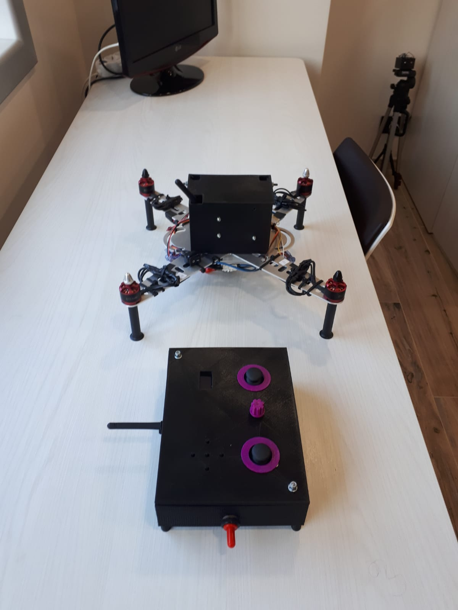
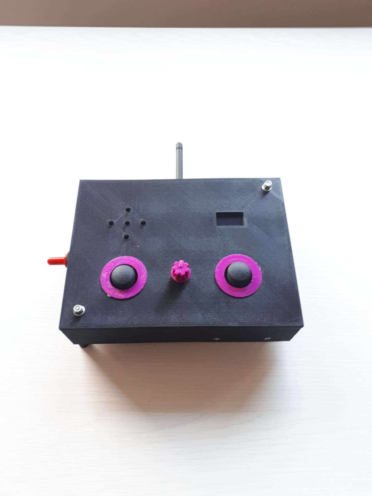

# Telecomando Drone
Progetto in cui viene realizzato un telecomando per pilotare un drone.

All'interno è presente un Arduino Mega che si occupa della lettura dei pulsanti, della scrittura sul monitor LCD e della comunicazione con il drone. 

Di seguito sono riportate alcune immagini del progetto.

</img>
</img>
