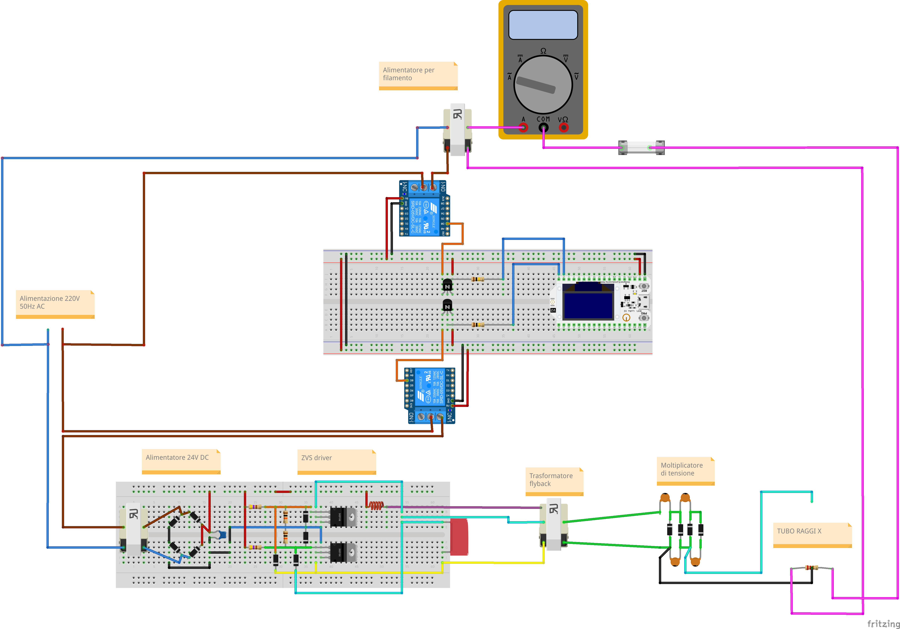
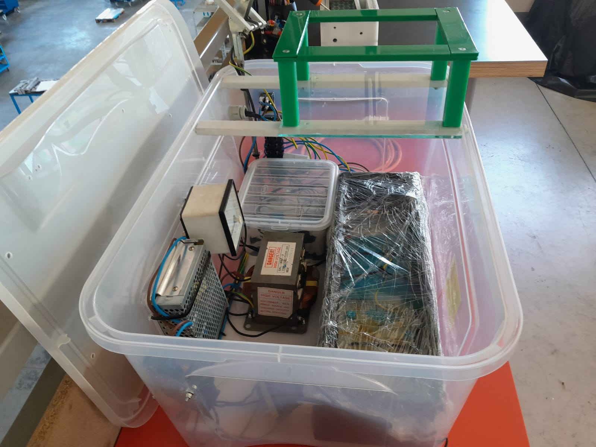
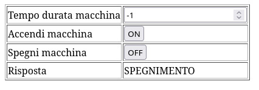

# Macchina a raggi X

In questo progetto abbiamo costruito una macchina a raggi x, per effettuare delle radiografie.

### Funzionamento

In questo progetto abbiamo provato a realizzare una macchina per radiografie. 
Questa macchina è collegata in rete e viene gestita tramite un’interfaccia web, con la quale si può spegnere, accendere e sapere l’ultimo comando che è stato eseguito.

---

### Hardware
La componente hardware si divide in due parti principali:
- un circuito per creare l’alta tensione che ha la funzione di accelerare gli elettroni
- un circuito per alimentare il filamento che ha la funzione di emettere gli elettroni
Di seguito è riportato lo schema elettrico e un'immagine della macchina realizzata.

Schema elettrico

Immagine hardware

---

### Interfaccia
Il codice si divide in un parti:
- boot.py → è il file che viene eseguito per primo ed quello che effettua la connessione alla rete wifi
- main.py → è il file che viene eseguito dopo il boot.py ed è quello che crea il servizio in internet

Immagini interfaccia web

### Autori
- [@GabrieleFerrero](https://github.com/GabrieleFerrero)
- [@IsabellaBianco](https://github.com/IsabellaBianco)

