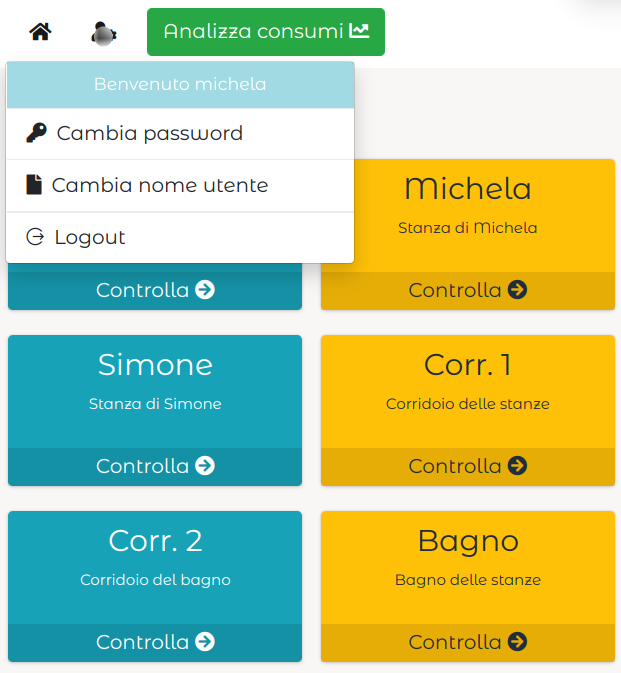

# Casa domotica

In questo progetto abbiamo costruito un sito web per poter controllare una casa a distanza.

### Hardware
_Fa ru_

### Funzionamento

La casa domotica è gestita nel seguente modo:
- un web server che risponde alla richieste fatte dai client ritornando la pagina web
- un thread che legge i consumi dei dispositivi della casa

---

### Interfaccia
La casa domotica presenta un'interfaccia web, formata dalle pagine che segue:
- il `login` che dopo 3 tentativi errati fa attendere un tempo che incrementerà ad ogni errore
 
 
- la pagina `home` che presenta un menu base e tutte le stanze della casa
 
 

- la pagina di una `stanza` che presenta tutti i dispositivi all'interno

- la pagina di un `dispositivo` che presenta il pulsante per cambiare di stato la luce, un grafico in tempon reale dello stato e un grafico per visualizzare i consumi tra due date

- la pagina `cambia password` per cambiare la password dell'utente

- la pagina `cambia nome utente` per cambiare il nome dell'utente

- la pagina `analizza consumi` che prensenta un pulsante per spegnere tutti di dispositivi della casa (o della stanza), un grafico in tempo reale dei consumi, un _line chart_ e un _donut chart_ per visualizzare i consumi tra due dati e di quali stanze (o dispositivi) sono.

- la pagina `amministratore` (ovviamente presente solo per l'utente amministratore) che permette di effettuare delle _query_ al DATABASE e visualizzarne il risultato

---

#### WEB API
È possibile ottenere i dati di download dei consumi in formato .json, interrogando il seguenteil server con il seguente link:
    <u>`indirizzo_ip:porta`/download?id_stanza=`id_stanza`&id_dispositivo=`id_dispositivo`</u>
dove:
- `id_stanza` è l'identificativo della stanza di cui si vuole scaricare i dati, in caso si volessero tutte le stanze l'opzione è uguale ad _all_.
- `id_dispositivo` è l'identificativo del dispositivo di cui si vuole scaricare i dati, in caso si volessero tutte i dispositivi l'opzione è uguale ad _all_.

---

### Autori
- [@GabrieleFerrero](https://github.com/GabrieleFerrero)
- [@IsabellaBianco](https://github.com/IsabellaBianco)

