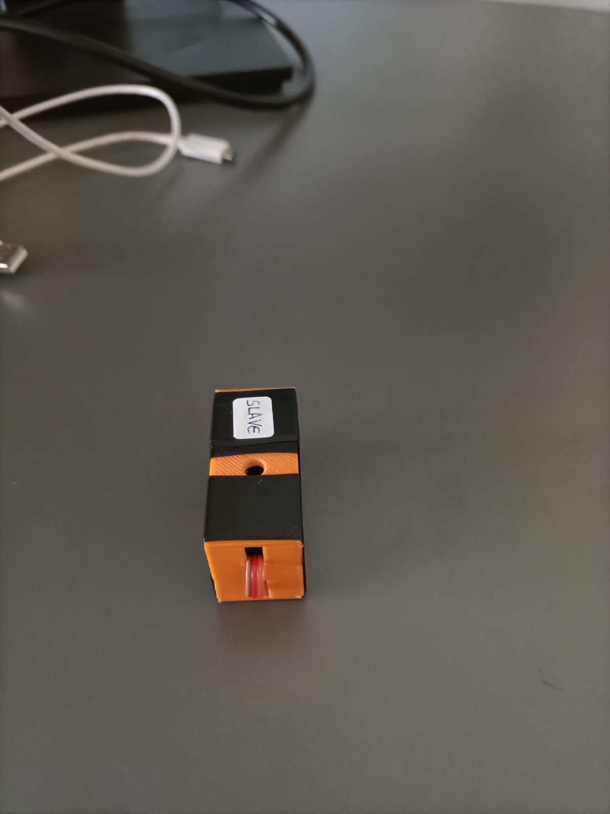
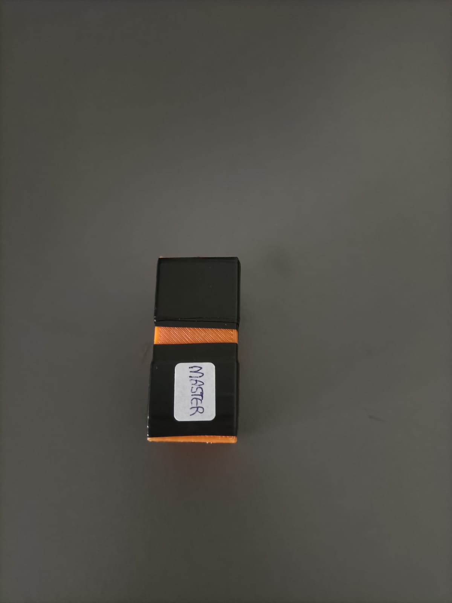
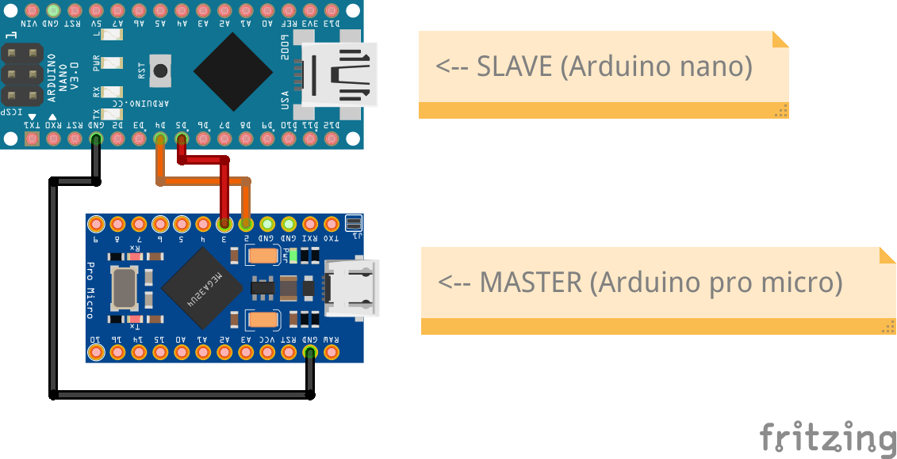

# USB computer keyboard simulator
This project makes it possible to use a computer, especially its keyboard, as an output device for another computer.

To see how it works, there is a demonstration [![**video on YouTube**]](https://youtu.be/wuPQ8DPLwTY).

## Hardware
The hardware looks like this. There are two ports, appropriately labelled with the words *slave* for the computer whose keyboard will be used and _master_ for the PC on which what has been typed will be written. Inside there is an **Arduino** **Nano** and an **Arduino ProMicro**, which, through an **I2C** communication, make the _master_ and the _slave_ talk to each other.

</img>
</img>

The **electrical circuit** is shown below:

</img>

## Software
The code that allows this device to work is shown below and inside the *master* and *slave* folders.

> **MASTER CODE**

```#include "Keyboard.h"
#include <Wire.h>

//ARDUINO MASTER

void setup() {
   Serial.begin(115200);
   Wire.begin();
   delay(1000);
   Keyboard.begin(); // initialize control over the keyboard:
}

void loop() {
  Wire.requestFrom(9,1);
  byte byte_received = Wire.read();
  if (byte_received != 255 && byte_received != 0){
    //Serial.println((char)byte_received);
    Keyboard.write((char)byte_received);
    
  }
}
```

> **SLAVE CODE**

```
#include <Wire.h>

//ARDUINO SLAVE

void setup() {
  delay(1000);
  Serial.begin(115200);
  delay(1000);
  // Start the I2C Bus as Slave on address 9
  Wire.begin(9);
  Wire.onRequest(requestEvent); 
  delay(1000);
  pinMode(11, OUTPUT);
}

void requestEvent(){
  if(Serial.available() != 0){
    char input = Serial.read();
    byte input_byte = (int)input;
    Wire.write(input_byte);
  }
}

void loop() {
  Wire.onRequest(requestEvent); 
}
```

### Authors
- [@GabrieleFerrero](https://github.com/GabrieleFerrero)
- [@IsabellaBianco](https://github.com/IsabellaBianco)
